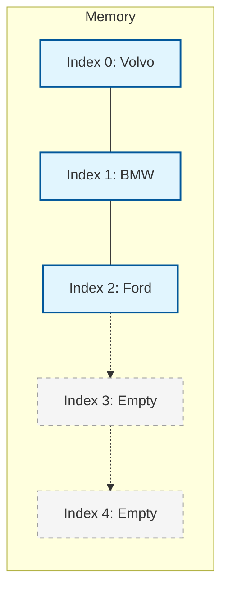

The `ArrayList` class is a resizable array, which can be found in the `java.util` package.

Think of a **Magic Backpack** 🎒.

- A normal array is like a box with fixed slots (Size 5). Once full, you can't add more.
- An `ArrayList` is like a magic backpack that **expands** as you put more items in it!

<div className="p-4 bg-white dark:bg-neutral-900 rounded-xl border border-neutral-200 dark:border-neutral-800 my-6">



<div className="text-muted-foreground mt-2 text-center text-sm">
  Visualizing an ArrayList in Memory
</div>

</div>

## Creating an ArrayList

```java
import java.util.ArrayList;

ArrayList<String> cars = new ArrayList<String>();
```

## Common Operations

### 1. Add Items

```java
cars.add("Volvo");
cars.add("BMW");
cars.add("Ford");
```

### 2. Access Items

```java
System.out.println(cars.get(0)); // Output: Volvo
```

### 3. Change Items

```java
cars.set(0, "Opel"); // Changes Volvo to Opel
```

### 4. Remove Items

```java
cars.remove(0); // Removes the first item
cars.clear();   // Removes ALL items
```

### 5. List Size

```java
System.out.println(cars.size());
```

## Loop Through an ArrayList

```java
for (int i = 0; i < cars.size(); i++) {
  System.out.println(cars.get(i));
}

// Or using Enhanced For Loop
for (String i : cars) {
  System.out.println(i);
}
```

<Callout>

**Tip 💡:** Unlike arrays, `ArrayList` cannot store primitive types (`int`, `char`, etc.). You must use Wrapper Classes like `Integer`, `Character`, etc.
`ArrayList<int> list = new ArrayList<>();` ❌ (Error)
`ArrayList<Integer> list = new ArrayList<>();` ✅ (Correct)

</Callout>

## Sorting an ArrayList

Use the `Collections.sort()` method.

```java
import java.util.Collections;

Collections.sort(cars); // Sorts alphabetically or numerically
```

<Quiz
  question="Which method is used to find the number of elements in an ArrayList?"
  options={["length()", "size()", "count()", "getSize()"]}
  correctAnswerIndex={1}
/>

---

<Callout>

**Note :** Java is a statically-typed language. It means that all variables must be declared before they can be used.

</Callout>

<div className="mt-8" />

## Challenge

Complete this chapter to unlock the next one.

<Challenge
  id="arraylist"
  nextChapterId="linkedlist"
  question="Create an ArrayList of Integers named 'nums'. Add 10 and 20. Print the size."
  expectedOutput="2"
  hint="Use 'ArrayList&lt;Integer&gt; nums = new ArrayList&lt;&gt;();' then 'nums.add(10);'"
  solution={`import java.util.ArrayList;

public class Main {
public static void main(String[] args) {
ArrayList<Integer> nums = new ArrayList<>();
nums.add(10);
nums.add(20);
System.out.println(nums.size());
}
}`}
defaultCode={``}
/>
