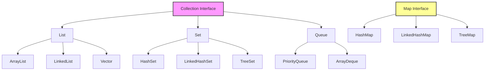

The **Collections Framework** in Java is a unified architecture for representing and manipulating collections (groups of objects).

Think of a **Toolbox** 🧰.

- You have different compartments for different tools.
- **List**: Like a row of slots where order matters (Screwdrivers sorted by size).
- **Set**: A bag where you just throw things in, and duplicates don't matter (Loose nails).
- **Map**: Labeled drawers (Label "A" -> Hammer, Label "B" -> Wrench).

## The Hierarchy

## Key Interfaces

### 1. List 📜

- **Ordered** collection (sequence).
- Allows **duplicates**.
- Access elements by **index** (0, 1, 2...).
- **Examples**: `ArrayList`, `LinkedList`.

### 2. Set 🎒

- **Unordered** collection.
- **No duplicates** allowed (Unique items only).
- **Examples**: `HashSet`, `TreeSet`.

### 3. Map 🗺️

- **Key-Value** pairs.
- Keys must be **unique**.
- Not technically a child of `Collection` interface, but part of the framework.
- **Examples**: `HashMap`, `TreeMap`.

<Callout>

**Tip 💡:**

- Need order? Use **List**.
- Need uniqueness? Use **Set**.
- Need lookup by key? Use **Map**.

</Callout>

<Quiz
  question="Which interface allows duplicate elements?"
  options={["Set", "List", "Map", "None"]}
  correctAnswerIndex={1}
/>

---

<Callout>

**Note :** Java is a statically-typed language. It means that all variables must be declared before they can be used.

</Callout>

## Challenge

Complete this chapter to unlock the next one.

<Challenge
  id="collections-overview"
  nextChapterId="arraylist"
  question="Which collection type would you use to store a list of student names where duplicates are allowed and order matters?"
  expectedOutput="List"
  hint="Think about the interface that maintains insertion order."
  solution={`// The answer is List (specifically ArrayList or LinkedList)
public class Main {
    public static void main(String[] args) {
        System.out.println("List");
    }
}`}
  defaultCode={`public class Main {
    public static void main(String[] args) {
        // Print the interface name
        System.out.println("");
    }
}`}
/>

## Key Takeaways

- **Framework**: A standard way to handle groups of objects.
- **Interfaces**: `List` (Ordered), `Set` (Unique), `Map` (Key-Value).
- **Implementations**: `ArrayList`, `HashSet`, `HashMap` are the most common.

## Common Pitfalls

> [!WARNING]
> **Raw Types**: Don't use `List list = new ArrayList();`. Always use Generics: `List<String> list = ...`.
>
> **Modification**: Don't remove items from a collection _while_ looping through it with a for-each loop. It causes a `ConcurrentModificationException`.

## What's Next?

We mentioned `<String>` and `<Integer>`. What are those angle brackets?
[Learn Generics →](/docs/generics)
