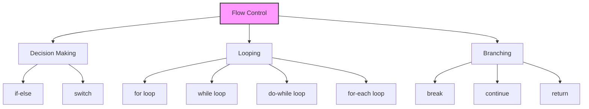

In Java, the execution of code typically happens from top to bottom, line by line. However, simply executing lines sequentially is not enough for complex logic. We need to make decisions, repeat tasks, or jump to different parts of the code. This is where **Flow Control** comes in.

**Flow Control** statements allow you to control the order in which the statements in your program are executed.

---

## Types of Flow Control

There are three main types of flow control statements in Java:

1.  **Decision-Making Statements** (Selection)
2.  **Looping Statements** (Iteration)
3.  **Branching Statements** (Jump)

### 1. Decision-Making Statements 🚦

These statements allow your program to choose between different paths of execution based on certain conditions.

*   [**if...else Statement**](/docs/if-else-statement): Executes a block of code if a condition is true, and another block if it's false.
*   [**switch Statement**](/docs/switch-statement): Selects one of many code blocks to be executed.

### 2. Looping Statements 🔄

These statements allow you to execute a block of code repeatedly.

*   [**for Loop**](/docs/for-loop): Used when you know exactly how many times you want to loop.
*   [**Enhanced for Loop**](/docs/enhanced-for-loop): Used to iterate through elements of arrays and collections.
*   [**while Loop**](/docs/while-and-do-while-loop): Loops through a block of code as long as a specified condition is true.
*   [**do...while Loop**](/docs/while-and-do-while-loop): Similar to `while`, but guarantees the code block is executed at least once.

### 3. Branching Statements ⤵️

These statements allow you to transfer control to another part of your program.

*   [**break Statement**](/docs/break-statement): Terminates the loop or switch statement.
*   [**continue Statement**](/docs/continue-statement): Skips the current iteration of a loop and proceeds to the next one.
*   **return Statement**: Exits from the current method.

<Callout>

**Tip 💡:** Mastering flow control is essential for writing logic. Without it, your program is just a static list of instructions!

</Callout>

<Quiz
  question="Which type of flow control statement is used to repeat a block of code?"
  options={["Decision-Making", "Looping", "Branching", "Sequential"]}
  correctAnswerIndex={1}
/>

## Challenge

<Challenge
  id="flow-control"
  nextChapterId="if-else-statement"
  question="What is the output of this code snippet?"
  expectedOutput="Start\nEnd"
  hint="The if condition is false, so the block inside is skipped."
  solution={`public class Main {
    public static void main(String[] args) {
        System.out.println("Start");
        if (false) {
            System.out.println("Middle");
        }
        System.out.println("End");
    }
}`}
  defaultCode={`public class Main {
    public static void main(String[] args) {
        // Write your code here
    }
}`}
/>
