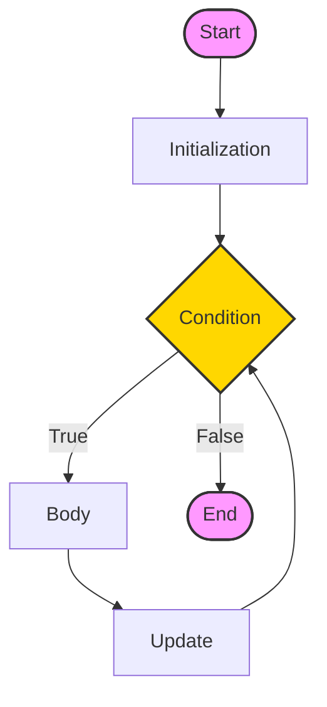

In computer programming, loops are used to repeat a block of code. For example, if you want to show a message 100 times, then rather than typing the same code 100 times, you can use a loop.

In Java, there are three types of loops:

*   **for loop**
*   **while loop**
*   **do...while loop**

This tutorial focuses on the for loop.

---

## 1. Java for Loop

Java `for` loop is used to run a block of code for a certain number of times. The syntax of `for` loop is:

```java
for (initialExpression; testExpression; updateExpression) {
    // body of the loop
}
```

Here,

1.  The **initialExpression** initializes and/or declares variables and executes only once.
2.  The **condition** is evaluated. If the **condition** is `true`, the body of the `for` loop is executed.
3.  The **updateExpression** updates the value of **initialExpression**.
4.  The **condition** is evaluated again. The process continues until the **condition** is `false`.

<Quiz
  question="Which part of the for loop runs only once?"
  options={["Condition", "Update Expression", "Initial Expression", "Body"]}
  correctAnswerIndex={2}
/>

### Working of for loop in Java with flowchart

<div className="p-4 bg-white dark:bg-neutral-900 rounded-xl border border-neutral-200 dark:border-neutral-800 my-6">



<div className="text-muted-foreground mt-2 text-center text-sm">
  Flowchart: Java for loop
</div>

</div>

### Example 1: Display a Text Five Times

```java
// Program to print a text 5 times
class Main {
  public static void main(String[] args) {

    int n = 5;
    // for loop
    for (int i = 1; i <= n; ++i) {
      System.out.println("Java is fun");
    }
  }
}
```

**Output:**

```plaintext
Java is fun
Java is fun
Java is fun
Java is fun
Java is fun
```

### Example 2: Display Sum of n Natural Numbers

```java
// Program to find the sum of natural numbers from 1 to 1000.
class Main {
  public static void main(String[] args) {

    int sum = 0;
    int n = 1000;

    // for loop
    for (int i = 1; i <= n; ++i) {
      // body inside for loop
      sum += i;     // sum = sum + i
    }

    System.out.println("Sum = " + sum);
  }
}
```

**Output:**

```plaintext
Sum = 500500
```

---

## 2. Java Nested for Loop

A for loop inside another for loop is called a nested for loop. It is often used to work with multidimensional arrays or print patterns.

```java
class Main {
    public static void main(String[] args) {
        // outer loop
        for (int i = 1; i <= 3; ++i) {
            // inner loop
            for (int j = 1; j <= 3; ++j) {
                System.out.println(i + " " + j);
            }
        }
    }
}
```

**Output:**

```plaintext
1 1
1 2
1 3
2 1
...
3 3
```

---

## 3. Java Infinite for Loop

If we set the test expression in such a way that it never evaluates to false, the for loop will run forever. This is called infinite for loop.

```java
// Infinite for Loop
class Infinite {
    public static void main(String[] args) {
        for (int i = 1; i <= 10; --i) {
            System.out.println("Hello");
        }
    }
}
```

Here, the test expression `i <= 10` is never `false` because `i` keeps decreasing.

<Callout>

**Tip 💡:** Stuck in an infinite loop? Press **Ctrl + C** in the terminal to kill it instantly! 🛑

</Callout>

---

## Key Takeaways

*   **Structure**: `for (initialization; condition; update)`.
*   **Use Case**: Best when you know _exactly_ how many times to loop (e.g., iterating an array).
*   **Nested Loops**: Use loops inside loops for grids or matrices.

## Common Pitfalls

> [!WARNING]
> **Off-by-One**: Looping from `0` to `<= length` instead of `< length` is a common error that causes "Index Out of Bounds" exceptions.

> [!WARNING]
> **Infinite Loops**: If your condition never becomes `false` (e.g., `i` never increments), your program will freeze.

## Challenge

<Challenge
  id="for-loop"
  nextChapterId="enhanced-for-loop"
  question="Write a for loop that prints numbers from 1 to 5."
  expectedOutput="1\n2\n3\n4\n5"
  hint="Use a for loop starting from i=1 to i<=5. Example: for(int i=0; i<5; i++)"
  solution={`public class Main {
    public static void main(String[] args) {
        for (int i = 1; i <= 5; i++) {
            System.out.println(i);
        }
    }
}`}
  defaultCode={``}
/>
