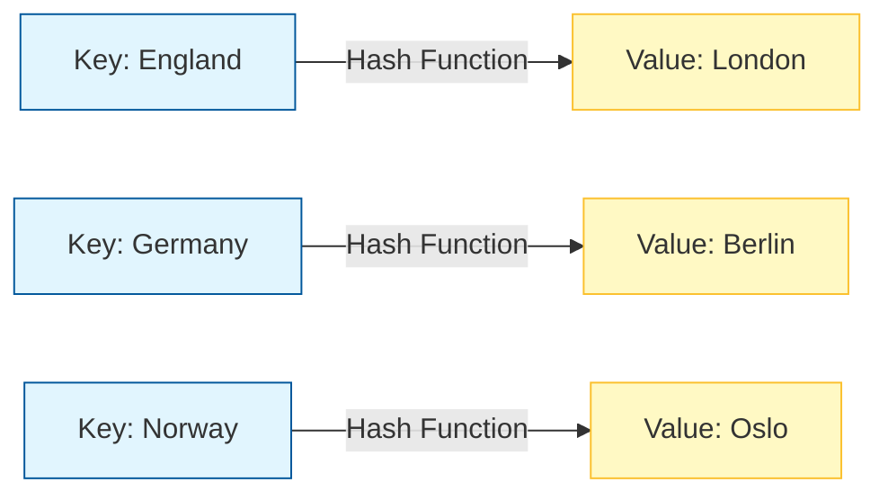

A `HashMap` store items in **Key/Value** pairs, and you can access them by an index of another type (e.g. a String).

Think of a **Dictionary** 📖.

- **Key**: The word (e.g., "Apple").
- **Value**: The definition (e.g., "A red fruit").
- You look up the definition using the word.

<div className="p-4 bg-white dark:bg-neutral-900 rounded-xl border border-neutral-200 dark:border-neutral-800 my-6">



<div className="text-muted-foreground mt-2 text-center text-sm">
  Visualizing Key-Value Mapping
</div>

</div>

## Creating a HashMap

```java
import java.util.HashMap;

// Key: String, Value: String
HashMap<String, String> capitalCities = new HashMap<String, String>();
```

## Common Operations

### 1. Add Items

```java
capitalCities.put("England", "London");
capitalCities.put("Germany", "Berlin");
capitalCities.put("Norway", "Oslo");
capitalCities.put("USA", "Washington DC");
```

### 2. Access Items

```java
System.out.println(capitalCities.get("England")); // Output: London
```

### 3. Remove Items

```java
capitalCities.remove("England");
capitalCities.clear(); // Removes ALL items
```

### 4. Map Size

```java
System.out.println(capitalCities.size());
```

## Loop Through a HashMap

You can loop through keys or values.

```java
// Print keys
for (String i : capitalCities.keySet()) {
  System.out.println(i);
}

// Print values
for (String i : capitalCities.values()) {
  System.out.println(i);
}

// Print keys and values
for (String i : capitalCities.keySet()) {
  System.out.println("key: " + i + " value: " + capitalCities.get(i));
}
```

<Callout>

**Tip 💡:** Keys in a HashMap must be **unique**. If you try to `put` a key that already exists, it will **overwrite** the old value!

</Callout>

## Other Types

Keys and values can be of different types.

```java
// Key: String (Name), Value: Integer (Age)
HashMap<String, Integer> people = new HashMap<String, Integer>();

people.put("John", 32);
people.put("Steve", 30);
people.put("Angie", 33);
```

<Quiz
  question="What happens if you insert a duplicate key into a HashMap?"
  options={[
    "It throws an error",
    "It ignores the new value",
    "It overwrites the old value",
    "It creates a duplicate entry",
  ]}
  correctAnswerIndex={2}
/>

---

<Callout>

**Note :** Java is a statically-typed language. It means that all variables must be declared before they can be used.

</Callout>

<div className="mt-8" />

## Challenge

Complete this chapter to unlock the next one.

<Challenge
  id="hashmap"
  nextChapterId="hashset"
  question="Create a HashMap&lt;String, String&gt; named 'codes'. Add ('US', 'United States'). Print the value for key 'US'."
  expectedOutput="United States"
  hint="Use 'codes.put(\x22US\x22, \x22United States\x22)' and 'codes.get(\x22US\x22)'."
  solution={`import java.util.HashMap;

public class Main {
public static void main(String[] args) {
HashMap<String, String> codes = new HashMap<>();
codes.put("US", "United States");
System.out.println(codes.get("US"));
}
}`}
defaultCode={``}
/>
