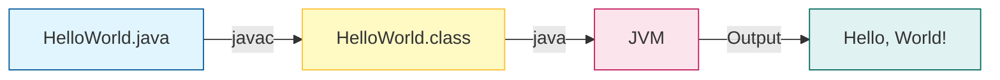

A "Hello, World!" is a simple program that outputs `Hello, World!` on the screen. Since it's a very simple program, it's often used to introduce a new programming language to a newbie.

Let's explore how Java "Hello, World!" program works.

## Java "Hello, World!" Program

```java title="HelloWorld.java"
class HelloWorld {
    public static void main(String[] args) {
        System.out.println("Hello, World!");
    }
}

```

```bash title="Output"
Hello, World!
```

```bash title="Output"
Hello, World!
```

<div className="p-4 bg-white dark:bg-neutral-900 rounded-xl border border-neutral-200 dark:border-neutral-800 my-6">



<div className="text-muted-foreground mt-2 text-center text-sm">
  From Code to Output
</div>

</div>

## How Java "Hello, World!" Program Works?

### 1. Your First Program

In Java, any line starting with `//` is a comment. Comments are intended for users reading the code to understand the intent and functionality of the program. It is completely ignored by the Java compiler (an application that translates Java program to Java bytecode that computer can execute). To learn more, visit [Java comments](/docs/comments).

### 2. class HelloWorld

In Java, every application begins with a class definition. In the program, HelloWorld is the name of the class, and the class definition is:

```java
class HelloWorld {
 ... .. ...
}

```

For now, just remember that every Java application has a class definition, and the name of the class should match the filename in Java.

### 3. public static void main(String[] args)

This is the main method. Every application in Java must contain the main method. The Java compiler starts executing the code from the main method.

**How does it work?** Good question. However, we will not discuss it in this article. After all, it's a basic program to introduce Java programming language to a newbie. We will learn the meaning of `public`, `static`, `void`, and how methods work? in later chapters.

For now, just remember that the main function is the entry point of your Java application, and it's mandatory in a Java program. The signature of the main method in Java is:

```java
public static void main(String[] args) {
... .. ...
}
```

### 4. System.out.println("Hello, World!");

The code above is a print statement. It prints the text `Hello, World!` to standard output (your screen). The text inside the quotation marks is called String in Java.

Notice the print statement is inside the main function, which is inside the class definition.

<Quiz
  question="What is the entry point of a Java application?"
  options={[
    "class definition",
    "main method",
    "print statement",
    "import statement",
  ]}
  correctAnswerIndex={1}
/>

<Callout>

**Tip 💡:** `public static void main` is a bit of a mouthful! Just memorize it for now. It's the magic spell that starts every Java program.

</Callout>

## Challenge

<Challenge
  id="hello-world"
  nextChapterId="variables-and-literals"
  question="Modify the program to print 'Hello Javapedia'."
  expectedOutput="Hello Javapedia"
  hint="Change the text inside the quotes."
  solution={`public class Main {
    public static void main(String[] args) {
        System.out.println("Hello Javapedia");
    }
}`}
  defaultCode={`public class Main {
    public static void main(String[] args) {
        System.out.println("Hello, World!");
    }
}`}
/>

## Key Takeaways

- **Class Definition**: Every Java program must have at least one class, and the filename must match the class name (e.g., `HelloWorld.java` contains `class HelloWorld`).
- **Main Method**: `public static void main(String[] args)` is the entry point where the program starts execution.
- **Printing**: `System.out.println()` is used to print text to the console.

## Common Pitfalls

> [!WARNING]
> **Case Sensitivity**: Java is case-sensitive. `Main` is different from `main`, and `String` is different from `string`.
>
> **Missing Semicolons**: Every statement in Java must end with a semicolon `;`. It's the most common syntax error for beginners!

## What's Next?

You've written your first program! Now, let's learn how to store and manipulate data using **Variables**.
[Learn about Variables & Literals →](/docs/variables-and-literals)
