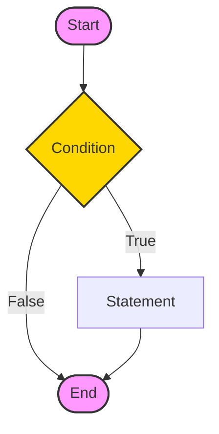
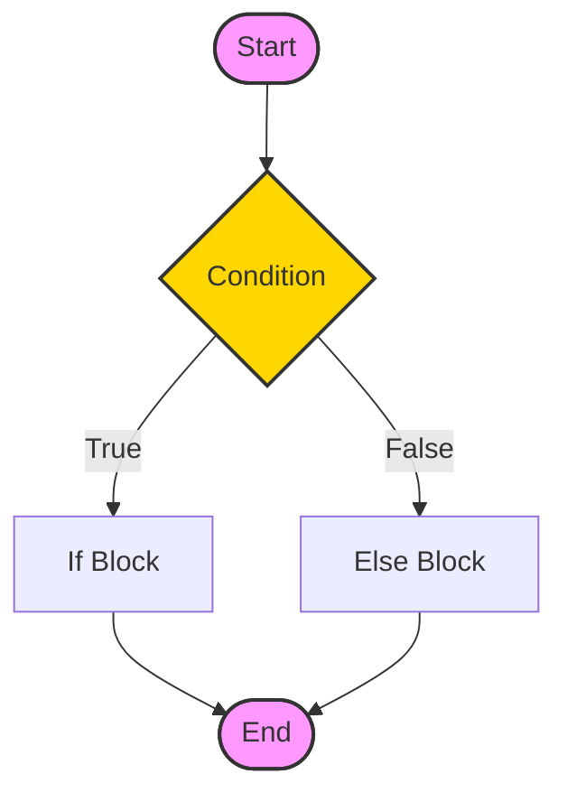

In programming, we use the `if..else` statement to run a block of code among more than one alternatives.

For example, assigning grades (A, B, C) based on the percentage obtained by a student.

- if the percentage is above **90**, assign grade **A**
- if the percentage is above **75**, assign grade **B**
- if the percentage is above **65**, assign grade **C**

## 1. Java if (if-then) Statement

The syntax of an **if-then** statement is:

```java
if (condition) {
  // statements
}
```

Here, `condition` is a boolean expression such as `age >= 18`.

- if `condition` evaluates to `true` , statements are executed
- if `condition` evaluates to `false` , statements are skipped

<Quiz
  question="What happens if the condition in an if statement is false?"
  options={[
    "The code inside the if block is executed",
    "The program crashes",
    "The code inside the if block is skipped",
    "The loop repeats",
  ]}
  correctAnswerIndex={2}
/>

## Working of if Statement

<div className="p-4 bg-white dark:bg-neutral-900 rounded-xl border border-neutral-200 dark:border-neutral-800 my-6">



<div className="text-muted-foreground mt-2 text-center text-sm">
  Flowchart: Java if statement
</div>

</div>

### Example 1: Java if Statement

```java
class IfStatement {
  public static void main(String[] args) {

    int number = 10;

    // checks if number is less than 0
    if (number < 0) {
      System.out.println("The number is negative.");
    }

    System.out.println("Statement outside if block");
  }
}
```

#### Output

```plaintext
Statement outside if block
```

In the program, `number < 0` is `false`. Hence, the code inside the parenthesis is **skipped**.

<Callout>

**Note:** If you want to learn more about about test conditions, visit [Java Relational Operators](/docs/operators#3-java-relational-operators) and [Java Logical Operators](/docs/operators#4-java-logical-operators).

</Callout>

We can also use Java Strings as the test condition.

### Example 2: Java if with String

```java
class Main {
  public static void main(String[] args) {
    // create a string variable
    String language = "Java";

    // if statement
    if (language == "Java") {
      System.out.println("Best Programming Language");
    }
  }
}
```

#### Output

```plaintext
Best Programming Language
```

In the above example, we are comparing two strings in the `if` block.

<Quiz
  question="Which keyword is used to execute a block of code if the 'if' condition is false?"
  options={["then", "else", "otherwise", "stop"]}
  correctAnswerIndex={1}
/>

<Callout>

**Tip 💡:** Pro tip: You don't need `if (isRaining == true)`. Just write `if (isRaining)`. It's cleaner and cooler! 😎

</Callout>

## 2. Java if...else (if-then-else) Statement

The `if` statement executes a certain section of code if the test expression is evaluated to `true`. However, if the test expression is evaluated to `false`, it does nothing.

In this case, we can use an optional `else` block. Statements inside the body of `else` block are executed if the test expression is evaluated to `false`. This is known as the **if-...else** statement in Java.

The syntax of the **if...else** statement is:

```java
if (condition) {
  // codes in if block
}
else {
  // codes in else block
}
```

Here, the program will do one task (codes inside if block) if the condition is true and another task (codes inside else block) if the condition is false.

## How the if...else statement works?

<div className="p-4 bg-white dark:bg-neutral-900 rounded-xl border border-neutral-200 dark:border-neutral-800 my-6">



<div className="text-muted-foreground mt-2 text-center text-sm">
  Flowchart: Java if-else statement
</div>

</div>

### Example 3: Java if...else Statement

```java
class Main {
  public static void main(String[] args) {
    int number = 10;

    // checks if number is greater than 0
    if (number > 0) {
      System.out.println("The number is positive.");
    }

    // execute this block
    // if number is not greater than 0
    else {
      System.out.println("The number is not positive.");
    }

    System.out.println("Statement outside if...else block");
  }
}
```

#### Output

```plaintext
The number is positive.
Statement outside if...else block
```

In the above example, we have a variable named `number`. Here, the test expression `number > 0` checks if `number` is greater than 0.

Since the value of the `number` is `10`, the test expression evaluates to `true`. Hence code inside the body of `if` is executed.

Now, change the value of the `number` to a negative integer. Let's say `-5`.

```java
int number = -5;
```

If we run the program with the new value of `number`, the output will be:

```plaintext
The number is not positive.
Statement outside if...else block
```

Here, the value of number is `-5`. So the test expression evaluates to `false`. Hence code inside the body of `else` is executed.

## 3. Java if...else...if Statement

In Java, we have an if...else...if ladder, that can be used to execute one block of code among multiple other blocks.

```java
if (condition1) {
  // codes
}
else if(condition2) {
  // codes
}
else if (condition3) {
  // codes
}
.
.
else {
  // codes
}
```

Here, `if` statements are executed from the top towards the bottom. When the test condition is `true`, codes inside the body of that `if` block is executed. And, program control jumps outside the **if...else...if** ladder.

If all test expressions are `false`, codes inside the body of `else` are executed.

## How the if...else...if ladder works?

If the first test condition if true, code inside first if block is executed, if the second condition is true, block inside second if is executed, and if all conditions are false, the else block is executed
Working of if...else...if ladder

### Example 4: Java if...else...if Statement

```java
class Main {
  public static void main(String[] args) {

    int number = 0;

    // checks if number is greater than 0
    if (number > 0) {
      System.out.println("The number is positive.");
    }

    // checks if number is less than 0
    else if (number < 0) {
      System.out.println("The number is negative.");
    }

    // if both condition is false
    else {
      System.out.println("The number is 0.");
    }
  }
}
```

#### Output

```plaintext
The number is 0.
```

In the above example, we are checking whether `number` is **positive**, **negative**, or **zero**. Here, we have two condition expressions:

- `number > 0` - checks if `number` is greater than `0`.
- `number < 0` - checks if `number` is less than `0`.

Here, the value of `number` is `0`. So both the conditions evaluate to `false`. Hence the statement inside the body of `else` is executed.

<Callout>

**Note:** Java provides a special operator called **ternary operator**, which is a kind of shorthand notation of **if...else...if** statement. To learn about the ternary operator, visit [Java Ternary Operator](/docs/operators#java-ternary-operator).

</Callout>

## 4. Java Nested if..else Statement

In Java, it is also possible to use `if..else` statements inside an `if...else` statement. It's called the nested `if...else` statement.

Here's a program to find the largest of **3** numbers using the nested `if...else` statement.

### Example 5: Nested if...else Statement

```java
class Main {
  public static void main(String[] args) {

    // declaring double type variables
    Double n1 = -1.0, n2 = 4.5, n3 = -5.3, largest;

    // checks if n1 is greater than or equal to n2
    if (n1 >= n2) {

      // if...else statement inside the if block
      // checks if n1 is greater than or equal to n3
      if (n1 >= n3) {
        largest = n1;
      }

      else {
        largest = n3;
      }
    } else {

      // if..else statement inside else block
      // checks if n2 is greater than or equal to n3
      if (n2 >= n3) {
        largest = n2;
      }

      else {
        largest = n3;
      }
    }

    System.out.println("Largest Number: " + largest);
  }
}
```

#### Output:

```plaintext
Largest Number: 4.5
```

In the above programs, we have assigned the value of variables ourselves to make this easier.

However, in real-world applications, these values may come from user input data, log files, form submission, etc.

<div className="mt-8" />

## Challenge

Complete this chapter to unlock the next one.

<Challenge
  id="if-else-statement"
  nextChapterId="switch-statement"
  question="Write a program that checks if a number (use 10) is positive. If so, print 'Positive'. Else, print 'Not Positive'."
  expectedOutput="Positive"
  hint="Use 'if (number > 0)' to check if the number is positive."
  solution={`public class Main {
    public static void main(String[] args) {
        int number = 10;
        if (number > 0) {
            System.out.println("Positive");
        } else {
            System.out.println("Not Positive");
        }
    }
}`}
  defaultCode={``}
/>
<div className="mt-8" />

## Key Takeaways

- **if**: Executes code only if the condition is `true`.
- **else**: Executes code if the `if` condition is `false`.
- **else if**: Checks a new condition if the previous one was false.
- **Nested**: You can put an `if` inside another `if`.

## Common Pitfalls

> [!WARNING]
> **Assignment vs Comparison**: `if (a = 5)` assigns 5 to `a`. `if (a == 5)` checks if `a` equals 5.
>
> **Missing Braces**: While single-line `if` statements work without `{ }`, it's safer to always use them to avoid bugs when adding more lines later.

## What's Next?

`if-else` is great for boolean checks, but what if you have to check one variable against 10 different values?
[Learn the Switch Statement →](/docs/switch-statement)
