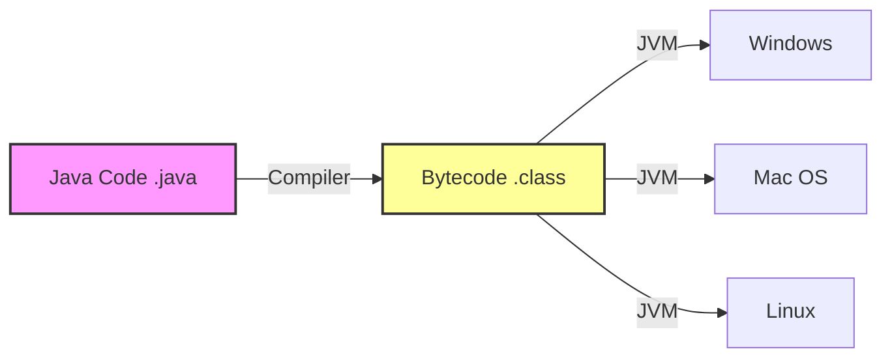

**Java** is a powerful, high-level, class-based, **object-oriented programming language** that is designed to have as few implementation dependencies as possible. It is a general-purpose programming language intended to let application developers **write once, run anywhere (WORA)**, meaning that compiled Java code can run on all platforms that support Java without the need for recompilation.

According to **Oracle**, the company that owns **Java**, **Java runs on 3 billion devices worldwide**, making it one of the most popular programming languages in the world.

To get started with Java programming, visit [Java Tutorials](/programs/introduction).

---

## A Brief History

*   **Origin**: Java was originally developed by **James Gosling** at **Sun Microsystems** (which has since been acquired by Oracle) and released in **1995** as a core component of Sun Microsystems' Java platform.
*   **Name**: The language was initially called **Oak** after an oak tree that stood outside Gosling's office. Later the project went by the name **Green** and was finally renamed **Java**, from Java coffee, a type of coffee from Indonesia.
*   **Evolution**: Java has evolved significantly. From the early days of Applets to modern cloud-native applications, Java has adapted to the changing landscape of software development.

---

## Features of Java Programming

<Quiz
  question="What is the primary philosophy behind Java's platform independence?"
  options={[
    "Write once, run anywhere",
    "Code once, compile twice",
    "Run only on Windows",
    "Write locally, deploy globally",
  ]}
  correctAnswerIndex={0}
/>

<Quiz
  question="Which of the following is NOT a feature of Java?"
  options={[
    "Platform Independent",
    "Object-Oriented",
    "Use of Pointers",
    "Robust",
  ]}
  correctAnswerIndex={2}
/>

### 1. Simple
Java is designed to be easy to learn. If you understand the basic concept of **Object-Oriented Programming (OOP)**, Java would be easy to master.
*   **No Pointers**: Java removed explicit pointers to avoid security risks and complexity.
*   **Automatic Memory Management**: You don't need to manually allocate and deallocate memory.

### 2. Object-Oriented
In Java, everything is an **Object**. Java can be easily extended since it is based on the Object model.
*   **Encapsulation**: Hiding data.
*   **Inheritance**: Reusing code.
*   **Polymorphism**: One interface, many forms.

### 3. Platform Independent
Java code is compiled into **bytecode**. This bytecode is platform-independent and can be run on any machine that has a **Java Virtual Machine (JVM)**.

<div className="p-4 bg-white dark:bg-neutral-900 rounded-xl border border-neutral-200 dark:border-neutral-800 my-6">



</div>

### 4. Robust
Robust means strong. Java uses strong memory management.
*   **Garbage Collection**: Automatic garbage collection runs on the JVM to get rid of objects which are not being used by a Java application anymore.
*   **Exception Handling**: Java provides a strong exception handling mechanism to handle runtime errors.

### 5. Secure
With Java's secure feature it enables to develop virus-free, tamper-free systems. Authentication techniques are based on public-key encryption.
*   **No Pointers**: Prevents unauthorized memory access.
*   **Bytecode Verifier**: Checks code fragments for illegal code that can violate access rights.

### 6. High Performance
Although Java is an interpreted language, it is designed to support "just-in-time" compilers, which compile bytecodes into machine code, so it performs very well.

### 7. Multithreaded
With Java's multithreaded feature it is possible to write programs that can perform many tasks simultaneously. This design feature allows the developers to construct interactive applications that can run smoothly.

---

## Java Editions

Java is distributed in three major editions:

1.  **Java SE (Standard Edition)**: This is the core Java platform. It contains all the libraries and APIs that every Java programmer should know (java.lang, java.util, etc.).
2.  **Java EE (Enterprise Edition)**: Now known as **Jakarta EE**. It is built on top of Java SE and is used for developing large-scale, distributed, and secure network applications.
3.  **Java ME (Micro Edition)**: This is a lightweight version of the Java platform, designed for mobile devices and embedded systems.

---

## Applications of Java Programming

According to Oracle, Java runs on **3 billion devices**.

### 1. Android Apps
Java is the official language for Android development. Although Kotlin is now preferred, a vast amount of Android code is still written in Java.

### 2. Web Applications
Java is widely used for server-side web development. Technologies like **Spring Boot**, **Jakarta EE**, and **Hibernate** power many enterprise web applications.
*   **Examples**: LinkedIn, AliExpress, IRCTC.

### 3. Big Data Technologies
Hadoop and other big data technologies are written in Java. Scala (which runs on JVM) is also popular in this domain.

### 4. Scientific Applications
Java is often the default choice for scientific applications, including natural language processing. The main reason is because it is safe, portable, maintainable, and comes with better high-level concurrency tools than C++ or any other language.

### 5. Financial Services
It is used in server-side applications in the financial industry. It is mostly used for writing server-side applications, processing data, and building trading systems.

---

## How to Learn Java?

### 1. Learn Java from Javapedia
We offer a complete series of easy-to-follow Java tutorials along with suitable examples. These tutorials are targeted for absolute beginners.

### 2. Practice, Practice, Practice
The only way to learn programming is by writing code. Don't just read the tutorials; type out the code and run it.

### 3. Build Projects
Start with small projects like a calculator or a simple game. Then move on to more complex applications.

---

## Key Takeaways

*   **WORA**: Write Once, Run Anywhere.
*   **Object-Oriented**: Everything is an object.
*   **Robust & Secure**: Memory management and security features.
*   **Vast Ecosystem**: Huge standard library and third-party frameworks.

## Common Pitfalls

> [!WARNING]
> **Java != JavaScript**: They are completely different languages. Java is compiled, statically typed, and runs on JVM. JavaScript is interpreted, dynamically typed, and runs in the browser.

## What's Next?

Now that you know _what_ Java is, let's get your computer ready to run it.
[Install Java Development Kit (JDK) →](/docs/installation)
```
