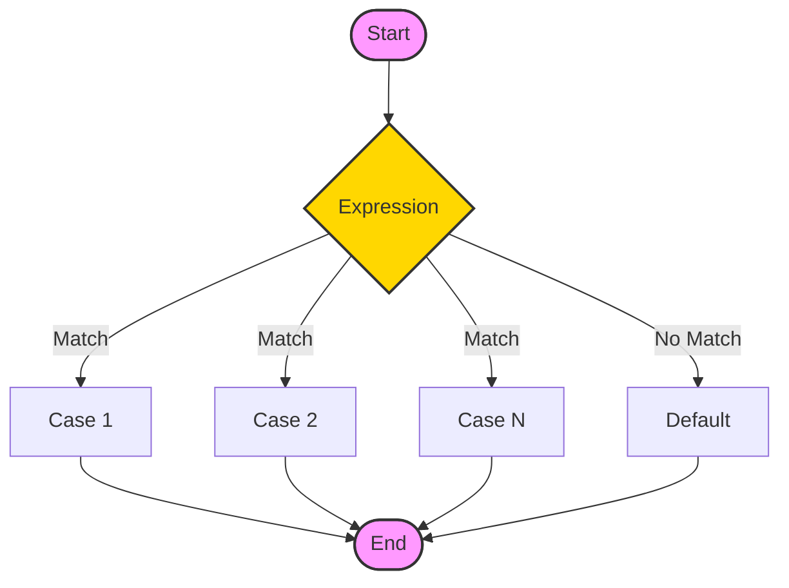

The `switch` statement allows us to execute a block of code among many alternatives.

The syntax of the `switch` statement in Java is:

```java
switch (expression) {

  case value1:
    // code
    break;

  case value2:
    // code
    break;

  ...
  ...

  default:
    // default statements
  }
```

## How does the switch-case statement work?

The `expression` is evaluated once and compared with the values of each case.

- If `expression` matches with `value1`, the code of `case value1` are executed. Similarly, the code of `case value2` is executed if `expression` matches with `value2`.
- If there is no match, the code of the **default case** is executed.

<Callout>

**Note:** The working of the switch-case statement is similar to the [Java if...else...if ladder](/docs/if-else-statement#3-java-if-else-if-statement). However, the syntax of the `switch` statement is cleaner and much easier to read and write.

</Callout>

### Example: Java switch Statement

#### Input

```java
// Java Program to check the size
// using the switch...case statement

class Main {
  public static void main(String[] args) {

    int number = 44;
    String size;

    // switch statement to check size
    switch (number) {

      case 29:
        size = "Small";
        break;

      case 42:
        size = "Medium";
        break;

      // match the value of week
      case 44:
        size = "Large";
        break;

      case 48:
        size = "Extra Large";
        break;

      default:
        size = "Unknown";
        break;

    }
    System.out.println("Size: " + size);
  }
}
```

#### Output:

```plaintext
Size: Large
```

In the above example, we have used the switch statement to find the size. Here, we have a variable `number`. The variable is compared with the value of each case statement.

Since the value matches with **44**, the code of `case 44` is executed.

```java
size = "Large";
break;
```

Here, the `size` variable is assigned with the value `Large`.

## Flowchart of switch Statement

<div className="p-4 bg-white dark:bg-neutral-900 rounded-xl border border-neutral-200 dark:border-neutral-800 my-6">



<div className="text-muted-foreground mt-2 text-center text-sm">
  Flowchart: Java switch statement
</div>

</div>

## break statement in Java switch...case

Notice that we have been using break in each case block.

```java
 ...
case 29:
  size = "Small";
  break;
...
```

The `break` statement is used to terminate the **switch-case** statement. If `break` is not used, all the cases after the matching case are also executed. For example,

#### Input

```java
class Main {
  public static void main(String[] args) {

    int expression = 2;

    // switch statement to check size
    switch (expression) {
      case 1:
        System.out.println("Case 1");

        // matching case
      case 2:
        System.out.println("Case 2");

      case 3:
        System.out.println("Case 3");

      default:
        System.out.println("Default case");
    }
  }
}
```

#### Output

```plaintext
Case 2
Case 3
Default case
```

In the above example, `expression` matches with `case 2`. Here, we haven't used the break statement after each case.

Hence, all the cases after `case 2` are also executed.

This is why the `break` statement is needed to terminate the **switch-case** statement after the matching case. To learn more, visit Java break Statement.

<Quiz
  question="What happens if you omit the 'break' statement in a switch case?"
  options={[
    "The program throws an error",
    "Execution continues to the next case",
    "The switch statement restarts",
    "The loop terminates",
  ]}
  correctAnswerIndex={1}
/>

<Callout>

**Tip 💡:** Forgetting `break` is a classic rookie mistake! It causes "fall-through", where ALL subsequent cases get executed. Unless you want that, always `break`!

</Callout>

## default case in Java switch-case

The switch statement also includes an **optional default case**. It is executed when the expression doesn't match any of the cases. For example,

#### Input

```java
class Main {
  public static void main(String[] args) {

    int expression = 9;

    switch(expression) {

      case 2:
        System.out.println("Small Size");
        break;

      case 3:
        System.out.println("Large Size");
        break;

      // default case
      default:
        System.out.println("Unknown Size");
    }
  }
}
```

#### Output

```plaintext
Unknown Size
```

In the above example, we have created a **switch-case** statement. Here, the value of `expression` doesn't match with any of the cases.

Hence, the code inside the **default case** is executed.

```java
default:
  System.out.println("Unknown Size);
```

<br />

<Callout>

**Note:** The Java switch statement only works with:

<ul>
  <li>
    {" "}
    <a href="/docs/variables-primitive-data-types">
      <b>Primitive data types:</b>
    </a>{" "}
    byte, short, char, and int{" "}
  </li>
  <li>
    {" "}
    <b>Enumerated types</b>{" "}
  </li>
  <li>
    {" "}
    <b>String Class</b>{" "}
  </li>
  <li>
    {" "}
    <b>Wrapper Classes:</b> Character, Byte, Short, and Integer.
  </li>
</ul>

</Callout>

<div className="mt-8" />

## Challenge

Complete this chapter to unlock the next one.

<Challenge
  id="switch-statement"
  nextChapterId="for-loop"
  question="Write a switch statement that checks the value of 'day' (use 3). If it is 3, print 'Wednesday'."
  expectedOutput="Wednesday"
  hint="Use 'case 3:' followed by a break statement."
  solution={`public class Main {
    public static void main(String[] args) {
        int day = 3;
        switch (day) {
            case 3:
                System.out.println("Wednesday");
                break;
            default:
                System.out.println("Other day");
        }
    }
}`}
  defaultCode={``}
/>
<div className="mt-8" />

## Key Takeaways

- **Efficiency**: `switch` is cleaner than many `if-else-if` blocks when checking one variable.
- **Case**: Defines a value to match.
- **Break**: Exits the switch block.
- **Default**: Runs if no cases match (like `else`).

## Common Pitfalls

> [!WARNING]
> **Fall-Through**: Forgetting `break` causes the code to "fall through" and execute the next case's code too.
>
> **Supported Types**: You can't switch on `long`, `float`, `double`, or `boolean`. Only `byte`, `short`, `char`, `int`, `String`, and enums are allowed.

## What's Next?

We can make decisions now. But what if we want to repeat a task 100 times?
[Master Loops (For Loop) →](/docs/for-loop)
