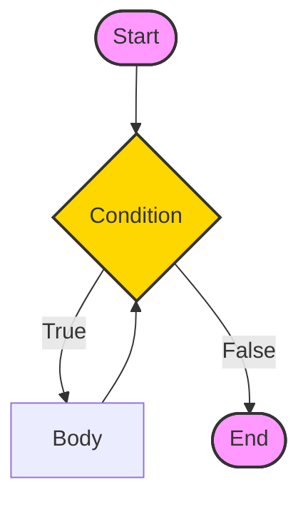
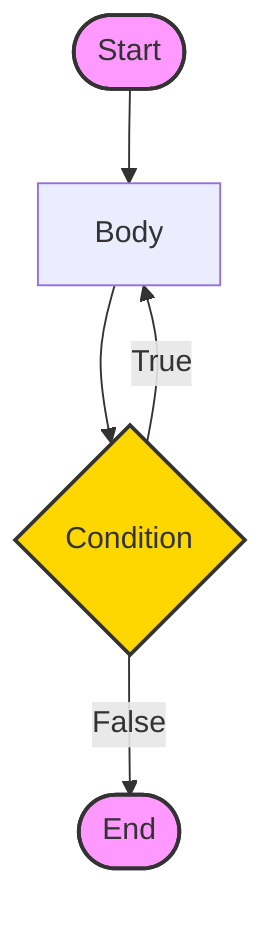

In computer programming, loops are used to repeat a block of code. For example, if you want to show a message 100 times, then you can use a loop. It's just a simple example; you can achieve much more with loops.

In the previous tutorial, you learned about [Java for loop](./for-loop). Here, you are going to learn about `while` and `do...while` loops.

## Java while loop

Java while loop is used to run a specific code until a certain condition is met. The syntax of the while loop is:

```java
// while loop
while (condition) {
  // body of loop
}
```

<Quiz
  question="When is the condition checked in a do...while loop?"
  options={[
    "Before the body executes",
    "After the body executes",
    "Never",
    "During execution",
  ]}
  correctAnswerIndex={1}
/>

Here,

1. A `while` loop evaluates the **testExpression** inside the parenthesis `()`.
2. If the **testExpression** evaluates to `true`, the code inside the `while` loop is executed.
3. The **testExpression** is evaluated again.
4. This process continues until the **testExpression** is `false`.
5. When the **testExpression** evaluates to `false`, the loop stops.

To learn more about the conditions, visit [Java relational](./operators#3-java-relational-operators) and [logical operators](./operators#4-java-logical-operators).

---

## Flowchart of while loop

<div className="p-4 bg-white dark:bg-neutral-900 rounded-xl border border-neutral-200 dark:border-neutral-800 my-6">



<div className="text-muted-foreground mt-2 text-center text-sm">
  Flowchart: Java while loop
</div>

</div>

### Example 1: Display Numbers from 1 to 5

```java
// Program to display numbers from 1 to 5

class Main {
  public static void main(String[] args) {

    // declare variables
    int i = 1, n = 5;

    // while loop from 1 to 5
    while(i <= n) {
      System.out.println(i);
      i++;
    }
  }
}
```

#### Output

```plaintext
1
2
3
4
5
```

Here is how this program works.

| Iteration | Variable         | Condition: i `<=` n | Action                                     |
| --------- | ---------------- | ------------------- | ------------------------------------------ |
| 1st       | `i = 1` `n = 5`  | `true`              | `1` is printed. `i` is increased to **2**. |
| 2nd       | `i = 2` `n = 5 ` | `true`              | `2` is printed. `i` is increased to **3**. |
| 3rd       | `i = 3` `n = 5`  | `true`              | `3` is printed.`i` is increased to **4**.  |
| 4th       | `i = 4` `n = 5`  | `true`              | `4` is printed. `i` is increased to **5**. |
| 5th       | `i = 5` ` n = 5` | `true`              | `5` is printed. `i` is increased to **6**. |
| 6th       | `i = 6` `n = 5`  | `false`             | The loop is terminated                     |

### Example 2: Sum of Positive Numbers Only

```java
// Java program to find the sum of positive numbers
import java.util.Scanner;

class Main {
  public static void main(String[] args) {

    int sum = 0;

    // create an object of Scanner class
    Scanner input = new Scanner(System.in);

    // take integer input from the user
    System.out.println("Enter a number");
    int number = input.nextInt();

    // while loop continues
    // until entered number is positive
    while (number >= 0) {
      // add only positive numbers
      sum += number;

      System.out.println("Enter a number");
      number = input.nextInt();
    }

    System.out.println("Sum = " + sum);
    input.close();
  }
}
```

#### Output

```plaintext
Enter a number
25
Enter a number
9
Enter a number
5
Enter a number
-3
Sum = 39
```

In the above program, we have used the [Scanner class](./scanner) to take input from the user. Here, `nextInt()` takes integer input from the user.

The `while` loop continues until the user enters a negative number. During each iteration, the number entered by the user is added to the `sum` variable.

When the user enters a negative number, the loop terminates. Finally, the total sum is displayed.

<Quiz
  question="What is the minimum number of times a while loop executes if the condition is initially false?"
  options={["1", "0", "Infinite", "Depends on the body"]}
  correctAnswerIndex={1}
/>

## Java do...while loop

The `do...while` loop is similar to while loop. However, the body of `do...while` loop is executed once before the test expression is checked. For example,

```java
do {
    // body of loop
} while(textExpression);
```

Here,

1. The body of the loop is executed at first. Then the **textExpression** is evaluated.
2. If the **textExpression** evaluates to `true`, the body of the loop inside the `do` statement is executed again.
3. The **textExpression** is evaluated once again.
4. If the **textExpression** evaluates to `true`, the body of the loop inside the `do` statement is executed again.
5. This process continues until the **textExpression** evaluates to false. Then the loop stops.

## Flowchart of do...while loop

<div className="p-4 bg-white dark:bg-neutral-900 rounded-xl border border-neutral-200 dark:border-neutral-800 my-6">



<div className="text-muted-foreground mt-2 text-center text-sm">
  Flowchart: Java do...while loop
</div>

</div>

Let's see the working of `do...while` loop.

---

### Example 3: Display Numbers from 1 to 5

```java
// Java Program to display numbers from 1 to 5

import java.util.Scanner;

// Program to find the sum of natural numbers from 1 to 100.

class Main {
  public static void main(String[] args) {

    int i = 1, n = 5;

    // do...while loop from 1 to 5
    do {
      System.out.println(i);
      i++;
    } while(i <= n);
  }
}
```

#### Output

```plaintext
1
2
3
4
5
```

Here is how this program works.

| Iteration | Variable         | Condition: i `<=` n | Action                                     |
| --------- | ---------------- | ------------------- | ------------------------------------------ |
|           | `i = 1` `n = 5`  | not checked         | `1` is printed. `i` is increased to **2**. |
| 1st       | `i = 2` `n = 5 ` | `true`              | `2` is printed. `i` is increased to **3**. |
| 2nd       | `i = 3` `n = 5`  | `true`              | `3` is printed.`i` is increased to **4**.  |
| 3rd       | `i = 4` `n = 5`  | `true`              | `4` is printed. `i` is increased to **5**. |
| 4th       | `i = 5` ` n = 5` | `true`              | `5` is printed. `i` is increased to **6**. |
| 5th       | `i = 6` `n = 5`  | `false`             | The loop is terminated                     |

---

### Example 4: Sum of Positive Numbers

```java
// Java program to find the sum of positive numbers
import java.util.Scanner;

class Main {
  public static void main(String[] args) {

    int sum = 0;
    int number = 0;

    // create an object of Scanner class
    Scanner input = new Scanner(System.in);

    // do...while loop continues
    // until entered number is positive
    do {
      // add only positive numbers
      sum += number;
      System.out.println("Enter a number");
      number = input.nextInt();
    } while(number >= 0);

    System.out.println("Sum = " + sum);
    input.close();
  }
}
```

#### Output 1

```plaintext
Enter a number
25
Enter a number
9
Enter a number
5
Enter a number
-3
Sum = 39
```

Here, the user enters a positive number, that number is added to the `sum` variable. And this process continues until the number is negative. When the number is negative, the loop terminates and displays the sum without adding the negative number.

#### Output 2

```plaintext
Enter a number
-8
Sum is 0
```

Here, the user enters a negative number. The test condition will be `false` but the code inside of the loop executes once.

<Callout>

**Tip 💡:** `do...while` is like shooting first and asking questions later. It ALWAYS runs at least once, even if the condition is false from the start!

</Callout>

## Infinite while loop

If **the condition** of a loop is always `true`, the loop runs for infinite times (until the memory is full). For example,

```java
// infinite while loop
while(true){
    // body of loop
}
```

## Infinite do...while loop

Here is an example of an infinite `do...while` loop.

```java
// infinite do...while loop
int count = 1;
do {
   // body of loop
} while(count == 1)
```

In the above programs, the **textExpression** is always `true`. Hence, the loop body will run for infinite times.

---

## for and while loops

The `for` loop is used when the number of iterations is known. For example,

```java
for (let i = 1; i <=5; ++i) {
   // body of loop
}
```

And `while` and `do...while` loops are generally used when the number of iterations is unknown. For example,

```java
while (condition) {
    // body of loop
}
```

<div className="mt-8" />

## Challenge

Complete this chapter to unlock the next one.

<Challenge
  id="while-and-do-while-loop"
  nextChapterId="break-statement"
  question="Write a while loop that prints numbers from 5 down to 1."
  expectedOutput="5\n4\n3\n2\n1"
  hint="Use the decrement operator (i--) to decrease the value."
  solution={`public class Main {
    public static void main(String[] args) {
        int i = 5;
        while (i >= 1) {
            System.out.println(i);
            i--;
        }
    }
}`}
  defaultCode={``}
/>
<div className="mt-8" />

## Key Takeaways

- **While**: Checks condition _before_ running. Might not run at all.
- **Do-While**: Checks condition _after_ running. Always runs at least once.
- **Use Case**: Best when you don't know the number of iterations (e.g., reading user input until they type "exit").

## Common Pitfalls

> [!WARNING]
> **Infinite Loops**: It's very easy to forget to update your counter (e.g., `i++`) inside a while loop, causing it to run forever.
>
> **Semicolon**: The `do...while` loop MUST end with a semicolon `;` after the condition. `do { } while(condition);`

## What's Next?

Sometimes we need to stop a loop early or skip an iteration.
[Learn Break Statement →](/docs/break-statement)
